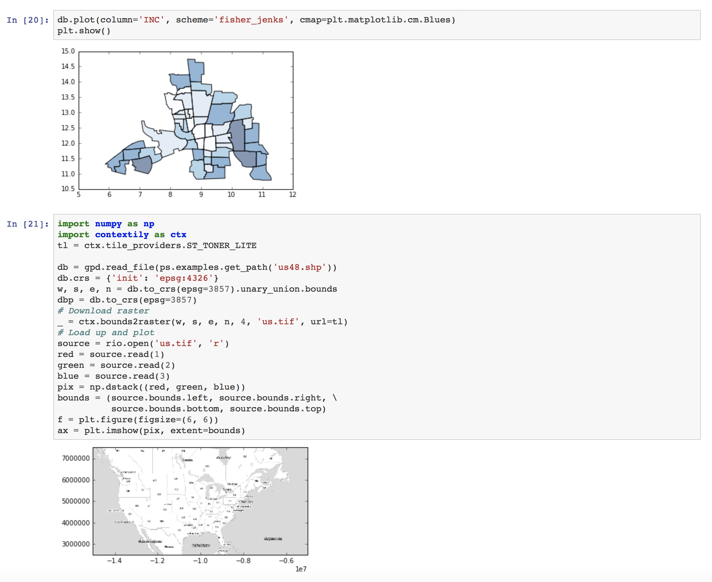

Introduction to Geospatial Data Analysis with Python
----------------------------------------------------


A sequence of four workshops for the [Graduate Quantitative Methods
Center](https://gradquant.ucr.edu/) (aka GradQuant) at the University of
California, Riverside ([UCR](http://ucr.edu)), presented by [Dr. Sergio
Rey](http://spatial.ucr.edu/peopleRey.html), Founding Director of the
[UCR Center for Geospatial Sciences](http://spatial.ucr.edu/).

This workshop series provides a gentle introduction to Python for
geospatial data analysis. Through hands-on instruction, the workhops
cover the open source Python Spatial Analysis Library
([PySAL](http://pysal.readthedocs.io/en/latest/index.html)) and the
related Python ecosystem of libraries to facilitate common tasks for
scientists and researchers working with geospatial data, and to provide
an introduction to methods of exploratory spatial data analysis and
spatial econometrics.

Workshops
=========

The series is organized into four workshops that provide computationally
based introductions to the *processing*, *visualization*, *exploration*,
and *modeling* of geospatial data.

(All workshops are from 9:10-11:00 a.m. on the dates listed.)

Workshop 1 (April  24): Introduction to Python for Spatial Data Analysis
------------------------------------
This workshop covers the core features of the Python language and serves as a
primer on using Python for Spatial Data Analysis. Users are introduced to
Jupyter Notebooks as a computational environment, followed by a series of
Jupyter notebooks that provide introductions to data structures, functions,
conditional execution, file processing, and plotting in Python. 


Workshop 2 (May 1): Geospatial Data Processing with Python
-------------------------------------------------------------

Geospatial data comes in a rich variety of formats and from many
different sources. Wrangling geospatial data is often a major component
of any applied research project, and becoming efficient in geoprocessing
is thus vital. This first workshop provides an overview of methods for
dealing with the *processing* of geospatial data. This includes
importing, and integrating, data in different formats (e.g. shapefile,
GeoJSON, WKT, WKB), and the treatment of different spatial coordinate
reference systems. Methods of deterministic spatial analysis involving
topological relationships and spatial operations including buffering,
dissolving, clipping, splitting and others, are covered.

### Lessons

-   Introduction to Shapely
-   Introduction to Geopandas
-   Geoprocessing with Geopandas


Workshop 3 (May 15): Exploratory Spatial Data Analysis
------------------------------------------------------
This third workshop covers the *visualization* and *exploration* of spatial data.
Here we explore a number of Python libraries for scientific
visualization in general, and geovisualization in particular. Basic
cartographic concepts involving choropleth mapping, color schemes, and
attribute classification are covered. Methods for exploratory
visualization where the focus is on quickly generating graphical
depictions and gather insights from geospatial are also examined.
Libraries supporting publication quality visualizations are presented.
Finally, the development of interactive geovisualizations is introduced.
This workshop also provides and introduction to methods that support the
*exploration* of spatial data. The goal of these methods is to uncover
and detect interesting geographical patterns. The formal representation
of neighbor relationships via spatial weights matrices are discussed.
Global tests for spatial autocorrelation are covered, followed by local
autocorrelation methods designed to detect hot-spots in geospatial data
patterns. Methods for the exploration of spatial-temporal data are also
introduced.

Workshop 4 (May 22): Introduction to Spatial Econometrics
---------------------------------------------------------

The final workshop in this series provides an introduction to the
*modeling* of relationships in spatial data using methods of [modern
spatial
econometrics](https://www.amazon.com/Modern-Spatial-Econometrics-Practice-GeoDaSpace/dp/0986342106).
The complications that arise due to spatial dependence and spatial
heterogeneity in empirical data sets are explored. Methodological topics
include an overview of model specifications for regression with spatial
data, methods of estimation, model diagnostics, and validation issues.

Prerequisites
=============

-   Basic knowledge of Python is assumed.
-   Familiarity with geospatial data and methods will be helpful, but
    not required.

Preparation for Workshops
=========================

Participants are expected to bring their own laptops and to follow the
instructions below for installing the required packages *prior* to the
workshop.

Download Anaconda Python Distribution
-------------------------------------

We will be using a number of Python packages for geospatial analysis,
and the easiest way to install these is to use the [Anaconda Python
Distribution.](https://www.anaconda.com/download/)

1.  Download Anaconda version 3.6 for your operating system.
2.  Once you have downloaded and installed Anaconda start a
    [terminal](https://www.quora.com/How-do-I-start-the-anaconda-command-prompt)

Install the Workshop Environment
--------------------------------

1.  Download the workshop
    [archive.](https://github.com/sjsrey/gdapy18/archive/master.zip)
2.  Extract the archive `unzip gdapy18-master.zip`
3.  `cd gdapy18-master/`
4.  `conda-env create -f workshop.yml`

That last step downloads a number of packages and could take up to 10
minutes if you have a slow connection.

Activate the Workshop Environment
---------------------------------

If using [conda version 4.4 or
later](https://stackoverflow.com/questions/49600611/python-anaconda-should-i-use-conda-activate-or-source-activate-in-linux):

1.  `conda activate workshop`

If using an older version of conda:

1.  On Windows: `activate workshop`
2.  On Mac/Linux: `source activate workshop`

Test the Installation
---------------------

1.  `jupyter-nbconvert --execute --ExecutePreprocessor.timeout=120 check_workshop.ipynb`

You should see something like:

``` {.bash}
[NbConvertApp] Converting notebook check_workshop.ipynb to html
[NbConvertApp] Executing notebook with kernel: python2
[NbConvertApp] Writing 435635 bytes to check_workshop.html
```

This will generate a file `check_workshop.html` in the local directory.
If you open this up in a browser you should see something like the
following inside the file:




If you do hit any snags, just email the instructor at
`sergio.rey at ucr.edu` for help.
